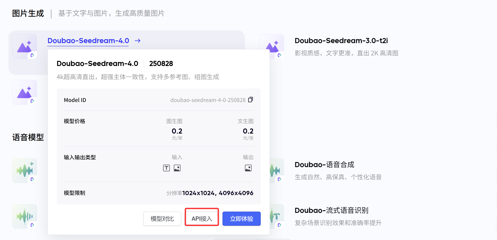

# Seedream Image Generate ComfyUI Node

一个基于火山引擎豆包大模型Seedream API的ComfyUI自定义节点，用于高质量图像生成。

<!-- 
使用示例：添加节点界面截图

-->
## 激活模型
1. 访问[火山模型广场](https://console.volcengine.com/ark/region:ark+cn-beijing/model?vendor=Bytedance&view=DEFAULT_VIEW)
2. 在<图片生成>下面找到Seedream-4.0模型，鼠标悬浮在模型上面，会出现以下界面，然后点击API接入：



3. 选择你的API_KEY，点击<选择使用>，然后点击开通模型。
## 功能特性

- 🎨 **多模型支持**: 支持doubao-seedream系列模型
- 🖼️ **多图像输入**: 支持最多5张输入图像（1张必选，4张可选）
- 📐 **灵活宽高比**: 支持常见宽高比选择（1:1, 2:3, 3:2, 4:3, 3:4, 16:9, 9:16, 21:9）
- 🔄 **顺序图像生成**: 支持自动、启用、禁用模式
- ⚙️ **完全可配置**: 所有API参数都可以在节点中配置
- 🎯 **多图输出**: 支持一次生成多张图像
- 📄 **详细信息输出**: 提供生成过程的详细文本信息

## 安装要求

1. 确保已安装ComfyUI
2. 安装依赖包：
```bash
pip install volcengine-python-sdk[ark]
```

## 配置

### 获取API密钥
1. 访问[火山引擎控制台](https://console.volcengine.com/)
2. 开通ARK服务并获取API Key
3. 设置环境变量：
```bash
export ARK_API_KEY="your_api_key_here"
```

### 安装节点
1. 将此文件夹复制到ComfyUI的`custom_nodes`目录
2. 重启ComfyUI
3. 在节点菜单中找到 "image/generation" → "Seedream Image Generate"

## 节点参数说明

### 必需参数
- **prompt**: 图像生成提示词（支持中英文）
- **image1**: 第一张输入图像（必需）
- **model**: 选择生成模型
  - `doubao-seedream-4-0-250828` (默认)
  - `doubao-seedream-4-0-preview`
  - `doubao-seedream-3-0`
- **aspect_ratio**: 图像宽高比
  - 1:1 (2048x2048), 2:3 (1664x2496), 3:2 (2496x1664), 4:3 (2304x1728), 3:4 (1728x2304), 16:9 (2560x1440), 9:16 (1440x2560), 21:9 (3024x1296)

### 输出参数
- **images**: 生成的图像列表
- **text**: 详细的生成信息文本，包括：
  - 生成参数信息
  - 每张图像的URL和尺寸
  - 模型返回的元数据
  - 错误信息（如果生成失败）

### 可选参数
- **image2-image5**: 额外的输入图像
- **sequential_image_generation**: 顺序生成模式 (auto/enabled/disabled)
- **max_images**: 最大生成图像数量 (1-10)
- **response_format**: 响应格式 (url/b64_json)
- **watermark**: 是否添加水印
- **stream**: 是否使用流式传输
- **base_url**: API基础URL
- **use_local_images**: 启用本地图像Base64编码（默认开启，官方支持）

## 使用示例

<!-- 
工作流程示例图片

-->

1. **基础图像生成**：
   - 连接一张图像到image1输入
   - 输入提示词："一个美丽的风景画"
   - 选择合适的宽高比
   - 点击执行
   - 查看images输出的生成图像
   - 查看text输出的详细信息

<!-- 
节点参数截图

-->

2. **多图像输入**：
   - 连接多张图像到image1-image5
   - 使用描述性提示词
   - 设置max_images控制输出数量

3. **顺序生成**：
   - 启用sequential_image_generation
   - 设置合适的max_images数量
   - 获得一系列相关的图像

4. **本地图像使用**：
   - 启用 `use_local_images=True`（默认开启）
   - 节点会自动将本地图像转换为Base64格式
   - 支持PNG、JPEG等常见格式，自动转换为PNG
   - 查看text输出了解转换状态和详细信息

<!-- 
生成结果示例
<div align="center">
  
  
  <p><em>左：输入图像 | 右：生成结果</em></p>
</div>
-->

## 注意事项

- 确保网络连接稳定，API调用需要网络访问
- 图像生成可能需要一些时间，请耐心等待
- API有使用限制，请合理使用避免超出配额
- ✅ **本地图像支持**: 现已支持本地图像输入（Base64编码格式）
- 启用 `use_local_images=True`（默认）时会自动转换本地图像为Base64格式
- 如果Base64转换失败，会自动回退到示例图像确保稳定性

## 故障排除

1. **API Key错误**: 确保正确设置ARK_API_KEY环境变量
2. **网络错误**: 确保网络连接正常，可以访问火山引擎服务
3. **图像加载失败**: 检查输入图像格式是否支持
4. **依赖包问题**: 确保已安装 `pip install 'volcengine-python-sdk[ark]'`

## 支持与反馈

如果遇到问题或有改进建议，欢迎提交Issue或Pull Request。
