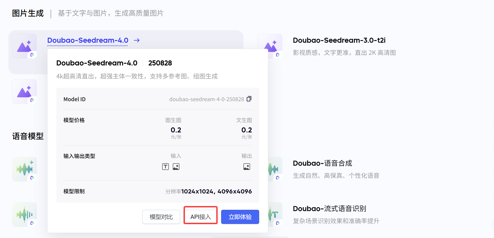

# Seedream Image Generate ComfyUI Node

一个基于火山引擎豆包大模型Seedream API和Seedance视频生成API的ComfyUI自定义节点，用于高质量图像和视频生成。

<!-- 
使用示例：添加节点界面截图

-->
## 激活模型
1. 访问[火山模型广场](https://console.volcengine.com/ark/region:ark+cn-beijing/model?vendor=Bytedance&view=DEFAULT_VIEW)
2. 在<图片生成>下面找到Seedream-4.0模型，鼠标悬浮在模型上面，会出现以下界面，然后点击API接入：



3. 选择你的API_KEY，点击<选择使用>，然后点击开通模型。
## 功能特性

### 图像生成 (Seedream)
- 🎨 **多模型支持**: 支持doubao-seedream系列模型
- 🖼️ **多图像输入**: 支持最多5张输入图像（1张必选，4张可选）
- 📐 **灵活宽高比**: 支持常见宽高比选择（1:1, 2:3, 3:2, 4:3, 3:4, 16:9, 9:16, 21:9）
- 🔄 **顺序图像生成**: 支持自动、启用、禁用模式
- ⚙️ **完全可配置**: 所有API参数都可以在节点中配置
- 🎯 **多图输出**: 支持一次生成多张图像
- 📄 **详细信息输出**: 提供生成过程的详细文本信息

### 视频生成 (Seedance)
- 🎬 **视频生成**: 支持doubao-seedance系列模型
- 🖼️ **多模态输入**: 支持图片、音频、视频作为输入
- 📐 **灵活分辨率**: 支持480p、720p分辨率
- 🎵 **音频驱动**: 支持音频输入驱动视频生成
- 🔗 **TOS上传**: 支持上传本地视频到火山TOS获取URL
- ⏱️ **轮询配置**: 节点界面可直接配置轮询参数

## 安装要求

1. 确保已安装ComfyUI
2. 安装依赖包：
```bash
pip install volcengine-python-sdk[ark] tos
```

## 配置

### 获取API密钥
1. 访问[火山引擎控制台](https://console.volcengine.com/)
2. 开通ARK服务并获取API Key
3. 设置环境变量：
```bash
export ARK_API_KEY="your_api_key_here"
```

### TOS配置（视频上传功能需要）
如需使用视频上传功能，还需设置TOS密钥：
```bash
export TOS_ACCESS_KEY="your_tos_access_key"
export TOS_SECRET_KEY="your_tos_secret_key"
```

### 安装节点
1. 将此文件夹复制到ComfyUI的`custom_nodes`目录
2. 重启ComfyUI
3. 在节点菜单中找到以下节点：
   - **image/generation** → "Seedream Image Generate"（图像生成）
   - **video/generation** → "Seedance Video Generate"（视频生成 - 单输入）
   - **Doubao/Seedance** → "Seedance2 视频生成"（视频生成 - 多模态输入）

## 节点参数说明

### Seedream Image Generate（图像生成）

#### 必需参数
- **prompt**: 图像生成提示词（支持中英文）
- **model**: 选择生成模型
  - `doubao-seedream-4-0-250828` (默认)
  - `doubao-seedream-4-5-251128`
  - `doubao-seedream-5-0-260128`
- **aspect_ratio**: 图像宽高比
  - 1:1 (2048x2048), 2:3 (1664x2496), 3:2 (2496x1664), 4:3 (2304x1728), 3:4 (1728x2304), 16:9 (2560x1440), 9:16 (1440x2560), 21:9 (3024x1296), 2K, 3K, 3.5K, 4K

#### 输出参数
- **images**: 生成的图像列表
- **text**: 详细的生成信息文本，包括：
  - 生成参数信息
  - 每张图像的URL和尺寸
  - 模型返回的元数据
  - 错误信息（如果生成失败）

### 可选参数

#### 图像输入
- **image1-image5**: 可选的输入图像（支持0-5张）
  - 不提供图像时为**文生图**模式
  - 提供图像时为**图生图**模式

#### 顺序生成控制（多图生成）
- **sequential_image_generation**: 顺序生成模式
  - `auto` - 自动（默认）
  - `enabled` - 启用
  - `disabled` - 禁用
- **max_images**: 最大生成图像数量 (1-10)
  - 对应官方API的 `sequential_image_generation_options.max_images`
  - 用于控制顺序生成时的图片数量
  - 示例：设置为4时，API会返回最多4张图片
  - ⚠️ **重要**：要生成多张图片，必须同时启用 `stream=True`
- **stream**: 流式传输
  - `True` - 启用流式传输（**生成多张图片时必须启用**）
  - `False` - 禁用（默认，只返回1张图片）

#### 其他参数
- **response_format**: 响应格式 (url/b64_json)
- **watermark**: 是否添加水印
- **stream**: 是否使用流式传输
- **base_url**: API基础URL
- **use_local_images**: 启用本地图像Base64编码（默认开启，官方支持）
- **seed**: 种子值（用于工作流跟踪，支持大整数）
- **enable_auto_retry**: 启用自动重试机制（默认开启，处理云端工作流异步问题）

---

### Seedance Video Generate（视频生成 - 单输入）

#### 必需参数
- **prompt**: 视频生成提示词
- **model**: `doubao-seedance-2-0-260128`
- **duration**: 视频时长（1-10秒）
- **watermark**: 是否添加水印
- **poll_interval**: 轮询间隔（1-30秒，默认3秒）
- **max_wait_time**: 最大等待时间（60-3600秒，默认600秒）

#### 可选参数
- **image**: 输入图片（图生视频）
- **video_url**: 参考视频URL
- **audio**: 音频输入

---

### Seedance2 视频生成（视频生成 - 多模态输入）

#### 必需参数
- **prompt**: 视频生成提示词
- **model**: 
  - `doubao-seedance-2-0-260128`
  - `doubao-seedance-2-0-fast-260128`
- **resolution**: 分辨率 (480p/720p)
- **ratio**: 宽高比 (16:9, 9:16, 1:1, 4:3, 3:4, 21:9)
- **duration**: 时长（4-15秒，默认11秒）
- **generate_audio**: 是否生成音频
- **poll_interval**: 轮询间隔（1-30秒，默认30秒）
- **max_wait_time**: 最大等待时间（60-3600秒，默认3600秒）

#### 可选参数
- **image_list**: 图片列表（连接 Seedance2 图片聚合节点，最多9张）
- **audio_list**: 音频列表（连接 Seedance2 音频聚合节点，最多3个）
- **video_url_list**: 视频URL列表（连接 Seedance2 视频聚合节点，最多3个）
- **seed**: 种子值

#### 辅助节点
- **Seedance2 图片聚合**: 聚合0-9张图片
- **Seedance2 音频聚合**: 聚合0-3个音频
- **Seedance2 视频聚合**: 上传0-3个本地视频到TOS，返回URL列表
  - 必需参数：bucket, endpoint, region, expires_seconds, reuse_existing, object_prefix
  - 可选参数：path_1, path_2, path_3

---

### TOS Upload Video URL（视频上传）

用于将本地视频上传到火山TOS获取预签名URL。

#### 必需参数
- **bucket**: TOS桶名称
- **endpoint**: TOS Endpoint（默认: tos-cn-beijing.volces.com）
- **region**: 地域（默认: cn-beijing）
- **expires_seconds**: URL有效期（60-2592000秒，默认3600）
- **reuse_existing**: 是否复用已有对象
- **object_prefix**: 对象前缀（默认: seedance/）

#### 可选参数
- **video**: VIDEO输入
- **file_path**: 本地文件路径

## 使用示例

<!-- 
工作流程示例图片

-->

1. **文生图模式（纯提示词生成）**：
   - 不连接任何图像输入
   - 输入提示词："一个美丽的风景画，高清，4K"
   - 选择合适的宽高比（如 16:9）
   - 点击执行
   - 查看images输出的生成图像
   - text输出会显示 "文生图模式"

2. **图生图模式（基于图像生成）**：
   - 连接1-5张图像到image1-image5
   - 输入提示词："转换为油画风格"
   - 选择合适的宽高比
   - 点击执行
   - text输出会显示 "图生图模式"

3. **顺序生成（一次生成多张图片）**：
   
   ⚠️ **关键配置要求**：
   - 必须启用 `stream = True`
   - 设置 `max_images > 1`
   - `sequential_image_generation` 设为 `"enabled"` 或 `"auto"`
   
   **配置示例**：
   ```
   sequential_image_generation: "auto"
   max_images: 3
   stream: True  ← 必须！
   ```
   
   这会生成对应的API调用：
   ```json
   {
     "sequential_image_generation": "auto",
     "sequential_image_generation_options": {
       "max_images": 3
     },
     "stream": true
   }
   ```
   
   **说明**：
   - `max_images` 参数会通过SDK自动转换为 API 的 `sequential_image_generation_options`
   - 内部使用 `SequentialImageGenerationOptions(max_images=N)` 类进行序列化
   - 节点会通过流式响应收集所有生成的图片（会过滤掉无效的中间数据）
   - 控制台会显示收集进度和有效图片数量
   - 适合需要多个变体的场景
   
   **重要提示**：
   - 只有有效的图片（包含URL或b64_json）才会被收集
   - 流式响应中的中间状态数据会被自动过滤
   - 最终返回的图片数量可能小于 `max_images` 设置的值（取决于API实际生成的有效图片数）

<!-- 
节点参数截图

-->

4. **本地图像使用**：
   - 启用 `use_local_images=True`（默认开启）
   - 节点会自动将本地图像转换为Base64格式
   - 支持PNG、JPEG等常见格式，自动转换为PNG
   - 查看text输出了解转换状态和详细信息

<!-- 
生成结果示例
<div align="center">
  
  
  <p><em>左：输入图像 | 右：生成结果</em></p>
</div>
-->

## 注意事项

- 确保网络连接稳定，API调用需要网络访问
- 图像生成可能需要一些时间，请耐心等待
- API有使用限制，请合理使用避免超出配额
- ✅ **本地图像支持**: 现已支持本地图像输入（Base64编码格式）
- 启用 `use_local_images=True`（默认）时会自动转换本地图像为Base64格式
- 如果Base64转换失败，会自动回退到示例图像确保稳定性

## 视频生成工作流示例

### 基础视频生成（单图片输入）
```
LoadImage → Seedance Video Generate → 视频输出
                ↑
            prompt: "一只猫在跳舞"
            duration: 5
```

### 多模态视频生成（Seedance2）
```
LoadImage (x3) → Seedance2 图片聚合 ─┐
                                      ├→ Seedance2 视频生成 → 视频输出
LoadAudio (x2) → Seedance2 音频聚合 ─┘
                prompt: "根据图片和音频生成视频"
                resolution: "720p"
```

### 本地视频作为参考输入
```
LoadVideo → Seedance2 视频聚合（上传到TOS）→ video_url_list
                                                  ↓
LoadImage → Seedance2 图片聚合 ─────────────────→ Seedance2 视频生成
                                                  ↑
                                        prompt: "参考视频风格生成新视频"
```

## 故障排除

1. **API Key错误**: 确保正确设置ARK_API_KEY环境变量
2. **TOS密钥错误**: 视频上传功能需要设置TOS_ACCESS_KEY和TOS_SECRET_KEY
3. **网络错误**: 确保网络连接正常，可以访问火山引擎服务
4. **图像加载失败**: 检查输入图像格式是否支持
5. **依赖包问题**: 确保已安装 `pip install 'volcengine-python-sdk[ark] tos'`
6. **视频上传失败**: 检查TOS桶名称、Endpoint和密钥是否正确

## 支持与反馈

如果遇到问题或有改进建议，欢迎提交Issue或Pull Request。
